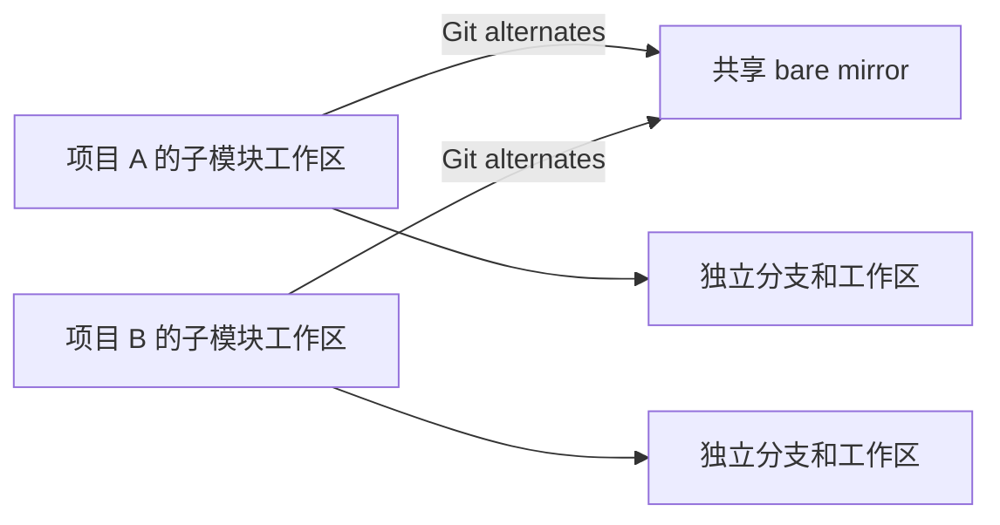

# gits

[English](README.md) | **简体中文**

[](https://github.com/leo1394/homebrew-gits/actions/workflows/ci.yml)
[](LICENSE)

> 更安全、更高效的 Git 子模块工作流，并可按项目显式共享 Git 对象。

`gits` 保留标准 Git 子模块的独立工作区，同时省去重复的初始化和更新操作。
项目可选择复用一组中央裸仓库，避免重复下载和存储相同的 Git 对象。

- **保留正常工作区：** 每个项目都有独立的子模块 checkout。
- **仅在明确要求时共享：** 共享模式按仓库启用，不会全局或隐式生效。
- **保持当前分支：** pull 只允许快进，不会替子模块选择其他分支。
- **保守清理：** 只有扫描完整、经过 30 天观察期并通过 fail-closed 安全校验后，才删除闲置 mirror。

## 为什么使用 gits

Git 子模块可以精确锁定版本，但多个项目引用相同仓库时，会重复下载和存储大量
对象。使用符号链接复用工作区虽然节省空间，却会破坏项目隔离。

`gits` 只共享 Git 对象，不共享工作目录：



共享路径只写入当前仓库的本地 `.git/config`。没有该配置的项目继续使用普通
Git 子模块存储。

## 安全设计

- 只有 `gits init PATH` 或 `gits config PATH` 才会启用共享模式。
- 父仓库 pull 使用 `--ff-only --no-recurse-submodules`。
- 已初始化的子模块保持当前分支，只向配置的 upstream 快进。
- 共享 init、pull 和 cleanup 共用一把中央锁。
- Cleanup 只删除完整的闲置 bare mirror，不删除被借用的单个对象。
- 扫描根缺失、alternate 无效、出现符号链接或未知条目、mirror 无法确认时，
  cleanup 会在删除前终止。
- 取消 `gits admit` 会恢复执行前的索引，不丢弃工作区改动。

`gits reset --hard` 会在选定范围内丢弃改动，执行前请确认路径。只有使用共享
路径的所有项目都被已登记扫描根覆盖时，cleanup 才可靠。

## 要求

- macOS 或 Linux
- Bash
- Git 2.31 或更高版本
- Homebrew（推荐）或用`curl`通过 Bash 安装

Homebrew Formula 在 macOS 上使用系统提供的 Git；在 Linux 上会在需要时安装
Git Formula。Bash 安装脚本会检测 Git；如果尚未安装，会通过系统可用的包管理器
安装 Git。

## 安装

### Homebrew

```bash
brew install leo1394/gits/gits
```

使用完整 Formula 名称时只安装并信任该 Formula，不需要先执行单独的
`brew tap` 命令。

后续升级：

```bash
brew update
brew upgrade gits
```

### Bash 

如果本机 Homebrew 版本过低，无法安装 Formula，可直接安装已发布的脚本：

```bash
curl -fsSL https://raw.githubusercontent.com/leo1394/homebrew-gits/master/install.sh | bash
```

安装脚本会使用同一 release tag 中 Formula 记录的 SHA256 校验下载内容，并将
`gits` 安装到 `~/.local/bin`。如果脚本提示该目录不在 `PATH` 中，请按提示添加；
再次执行同一命令即可升级。也可以指定版本或安装目录：

```bash
curl -fsSL https://raw.githubusercontent.com/leo1394/homebrew-gits/master/install.sh | GITS_VERSION=0.2.20 bash
curl -fsSL https://raw.githubusercontent.com/leo1394/homebrew-gits/master/install.sh | GITS_INSTALL_DIR=/absolute/bin bash
```

## 快速开始

### 标准子模块

不传共享路径时使用普通 Git 子模块存储：

```bash
cd /path/to/project
gits init
gits pull
```

### 按项目共享 Git 对象

传入路径即可为当前项目启用共享对象：

```bash
cd /path/to/project
gits init ~/.cache/gits
gits list
```

规范化后的路径只存入当前仓库：

```ini
[gits]
    sharedSubmodules = /Users/you/.cache/gits
```

其他项目不会受影响。查看、更换或关闭配置：

```bash
gits config
gits config /another/shared/path
gits config --unset
```

### 提交选中的改动

```bash
gits admit scripts
gits admit android ios
gits admit --all
```

`--all` 只选择 `.gitmodules` 中声明的全部子模块，不会暂存无关文件。命令会
打开 Git 配置的编辑器并预填建议提交信息。

## 常用命令

| 任务 | 命令 |
| --- | --- |
| 初始化标准子模块 | `gits init` |
| 启用共享对象并初始化 | `gits init ~/.cache/gits` |
| 更新全部当前分支 | `gits pull` |
| 更新指定子模块 | `gits pull scripts android` |
| 查看路径、URL 和缓存状态 | `gits list` |
| 查看共享路径 | `gits config` |
| 暂存并提交指定路径 | `gits admit PATH...` |
| 取消暂存指定子模块 | `gits reset PATH...` |
| 恢复指定的已记录提交 | `gits reset --hard PATH...` |
| 使用标准子模块状态 | `gits status` |

`add`、`status`、`update`、`deinit`、`foreach`、`summary`、`sync`、
`set-branch`、`set-url` 和 `absorbgitdirs` 会把剩余参数传给对应的
`git submodule` 命令。

## 清理闲置 mirror

先登记所有可能包含共享目录消费者的目录树：

```bash
gits cleanup --append ~/Code
gits cleanup --list
```

先预览；mirror 连续闲置至少 30 天并变为 eligible 后再执行清理：

```bash
gits cleanup --dry-run
gits cleanup
```

`gits cleanup` 与 `gits cleanup --apply` 等效，删除前都会重新扫描。如果扫描
不完整或校验结果不明确，命令不会删除任何内容。

## 开发

```bash
bash -n bin/gits install.sh tests/gits_test.sh
bash tests/gits_test.sh
ruby -c Formula/gits.rb
brew style Formula/gits.rb
```

完整发布流程见 [RELEASING-ZH.md](RELEASING-ZH.md)。

## License

MIT，见 [LICENSE](LICENSE)。
