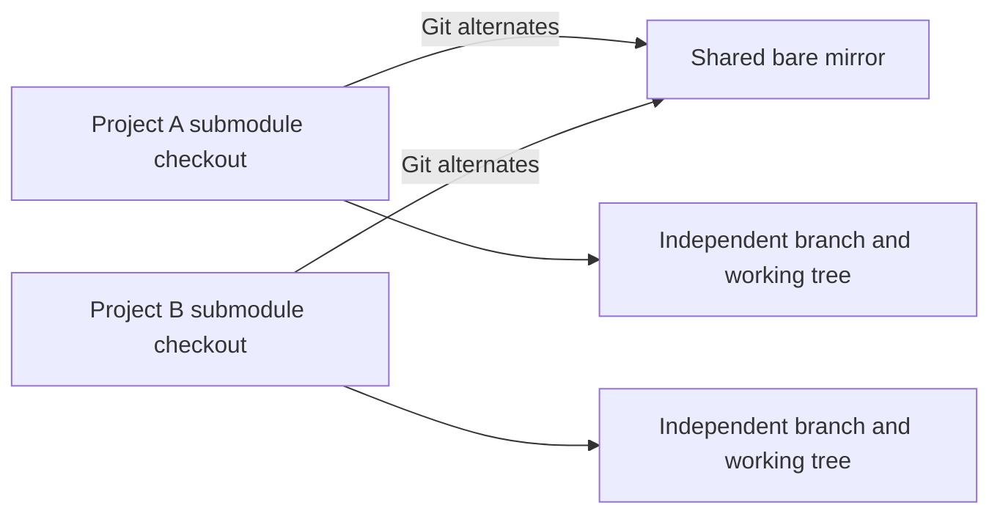

# gits

**English** | [简体中文](README-ZH.md)

[](https://github.com/leo1394/homebrew-gits/actions/workflows/ci.yml)
[](LICENSE)

> A safer, faster workflow for Git submodules, with optional project-scoped
> object sharing.

`gits` keeps standard Git submodule checkouts while removing repetitive setup
and update work. Projects may opt into a shared set of bare mirrors to avoid
downloading and storing the same Git objects again.

- **Keep normal checkouts:** every project has its own submodule working tree.
- **Share only when asked:** shared mode is enabled per repository, never
  globally or implicitly.
- **Preserve branches:** pull is fast-forward-only and does not choose another
  submodule branch.
- **Clean conservatively:** unused mirrors are deleted only after complete
  scans, a 30-day waiting period, and fail-closed validation.

## Why gits

Git submodules provide precise versioning, but repeated clones waste bandwidth
and disk space when many projects use the same repositories. Replacing working
trees with symlinks saves space but breaks project isolation.

`gits` shares Git objects, not working directories:



The shared path is recorded in the current repository's local `.git/config`.
Projects without that setting continue to use ordinary Git submodule storage.

## Safety by design

- Shared mode starts only with `gits init PATH` or `gits config PATH`.
- The superproject pull uses `--ff-only --no-recurse-submodules`.
- Initialized submodules stay on their current branches and only fast-forward
  to their configured upstreams.
- Shared init, pull, and cleanup operations use one central lock.
- Cleanup removes whole unused bare mirrors, never individual borrowed objects.
- Missing scan roots, invalid alternates, symlinks, unknown entries, or
  unverifiable mirrors stop cleanup before deletion.
- A cancelled `gits admit` restores the previous index without discarding
  working-tree changes.

`gits reset --hard` is intentionally destructive within its selected scope.
Review the paths before running it. Cleanup is reliable only when every project
using a shared path is covered by a registered scan root.

## Requirements

- macOS or Linux with Homebrew
- Bash
- Git 2.31 or later

The Homebrew formula uses the Git provided by macOS. On Linux, Homebrew installs
its Git formula when needed.

## Install

```bash
brew tap leo1394/gits
brew install gits
```

Upgrade later with:

```bash
brew update
brew upgrade gits
```

## Quick start

### Standard submodules

No shared path means normal Git submodule storage:

```bash
cd /path/to/project
gits init
gits pull
```

### Project-scoped object sharing

Pass a path once to enable shared objects for this project:

```bash
cd /path/to/project
gits init ~/.cache/gits
gits list
```

The canonical path is stored only in this repository:

```ini
[gits]
    sharedSubmodules = /Users/you/.cache/gits
```

Other projects remain unchanged. To inspect, change, or disable the setting:

```bash
gits config
gits config /another/shared/path
gits config --unset
```

### Commit selected changes

```bash
gits admit scripts
gits admit android ios
gits admit --all
```

`--all` selects every submodule declared in `.gitmodules`; it does not stage
unrelated files. The configured Git editor opens with a suggested message.

## Daily commands

| Task | Command |
| --- | --- |
| Initialize standard submodules | `gits init` |
| Enable shared objects and initialize | `gits init ~/.cache/gits` |
| Update all current branches | `gits pull` |
| Update selected submodules | `gits pull scripts android` |
| Show paths, URLs, and cache state | `gits list` |
| Show the configured shared path | `gits config` |
| Stage and commit selected paths | `gits admit PATH...` |
| Unstage selected submodules | `gits reset PATH...` |
| Restore selected recorded commits | `gits reset --hard PATH...` |
| Use standard submodule status | `gits status` |

`add`, `status`, `update`, `deinit`, `foreach`, `summary`, `sync`,
`set-branch`, `set-url`, and `absorbgitdirs` pass their remaining arguments to
the corresponding `git submodule` command.

## Clean unused mirrors

Register every directory tree that may contain projects using the shared path:

```bash
gits cleanup --append ~/Code
gits cleanup --list
```

Preview first, then apply after eligible mirrors have remained unused for at
least 30 days:

```bash
gits cleanup --dry-run
gits cleanup
```

`gits cleanup` and `gits cleanup --apply` are equivalent. Both perform a fresh
scan before deletion. If the scan is incomplete or validation is ambiguous,
nothing is deleted.


## Development

```bash
bash -n bin/gits tests/gits_test.sh
bash tests/gits_test.sh
ruby -c Formula/gits.rb
brew style Formula/gits.rb
```

See [RELEASING.md](RELEASING.md) for the release procedure.

## License

MIT. See [LICENSE](LICENSE).
